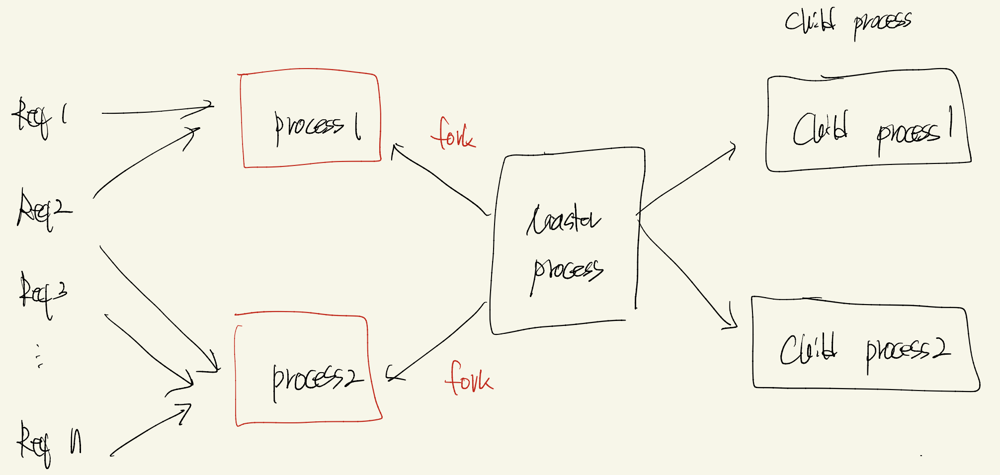

# Node-Best-Way

## Purpose

- [x] use RabbitMQ -> Message Broker
- [x] use NginX -> Load Balance

## Use Tech

- Nodejs Cluster
- Master and Child Process
- Production with PM2
- Use Messaing Queue (RabbitMQ)
- Use NgingX Load Balance (reverse proxy)

## Desc

> Nodejs Cluster (Node안에 Thread단에서 이뤄지는 작업)

- Nodejs는 Single Thread이기 때문에, 여려요청이 들어와도 한곳에서 한 Thread 안에서 처리를 진행하게 된다.
- 만약, A 라는 작업이 20s초가 걸리는 작업이라면 서버는 A요청을 끝난 후 다른 B, C, D 작업을 처리하게 된다.
- Fork를 사용하여서 Master-Child 방식으로 운영
- Cluster Module을 사용하여 CPU수 만큼 할당

> pm2

- <a href="https://pm2.keymetrics.io/docs/usage/process-management/"> pm2 Document </a>
- <a href="https://app.pm2.io/">pm2 io </a>

> child_process (Node 안에서 child_process)

- 
- Multi Processing In Nodejs

> RabbitMQ

- 더 공부해야 할듯 너무 어렵스...

> NginX

- Reverse Proxy
- Load Balance
- Caching Server

```
    // use Docker
    install > docker run -d --name rabbitmq -p 5672:5672 -p 15672:15672 --restart=unless-stopped rabbitmq:management

    connect > http://localhost:15672

    id : guest
    pw : guest
```

## Issue

> pm2 Interpreter error

```
    ./node_modules/.bin/pm2 install typescript
```

> pm2 runtime issue

```
    pm2-runtime ...
```
